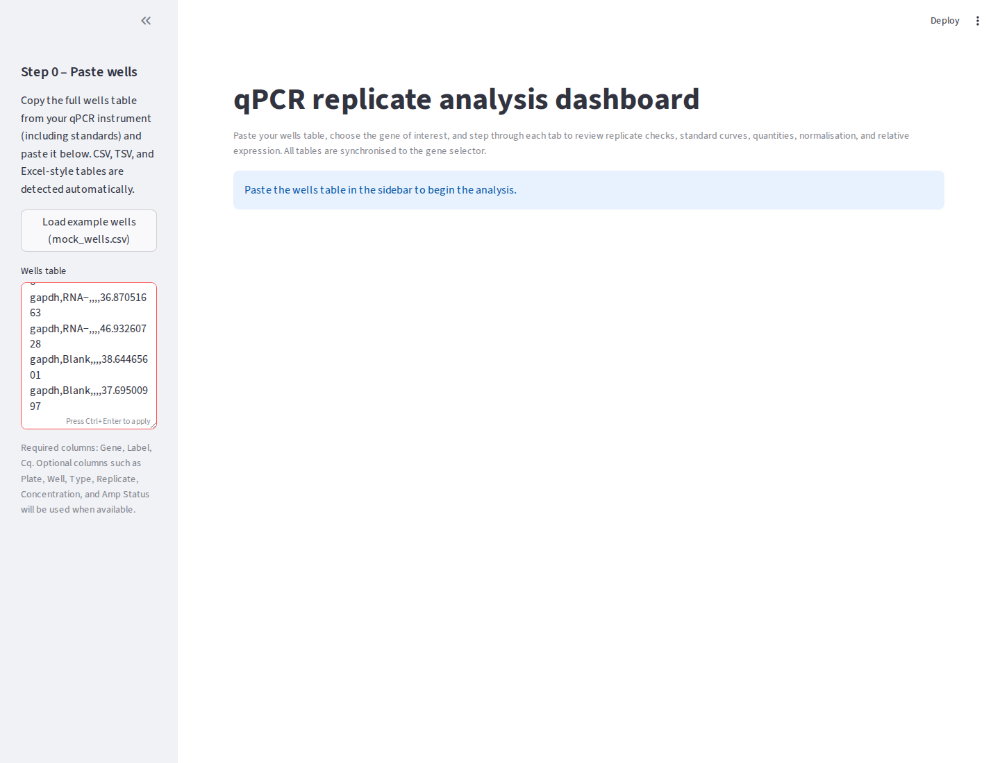
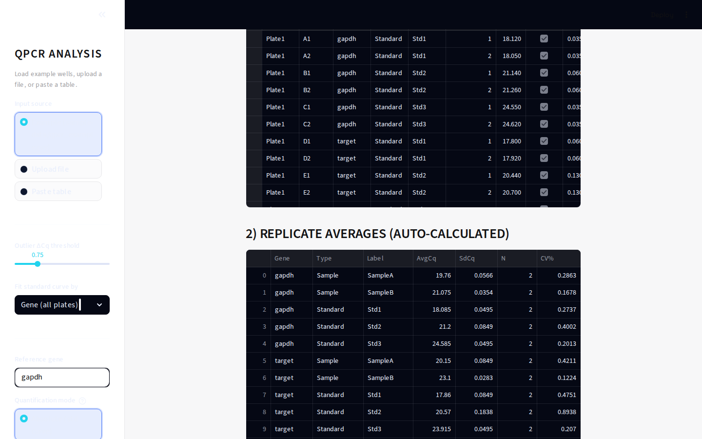
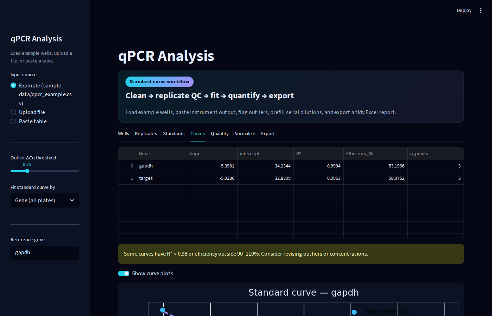
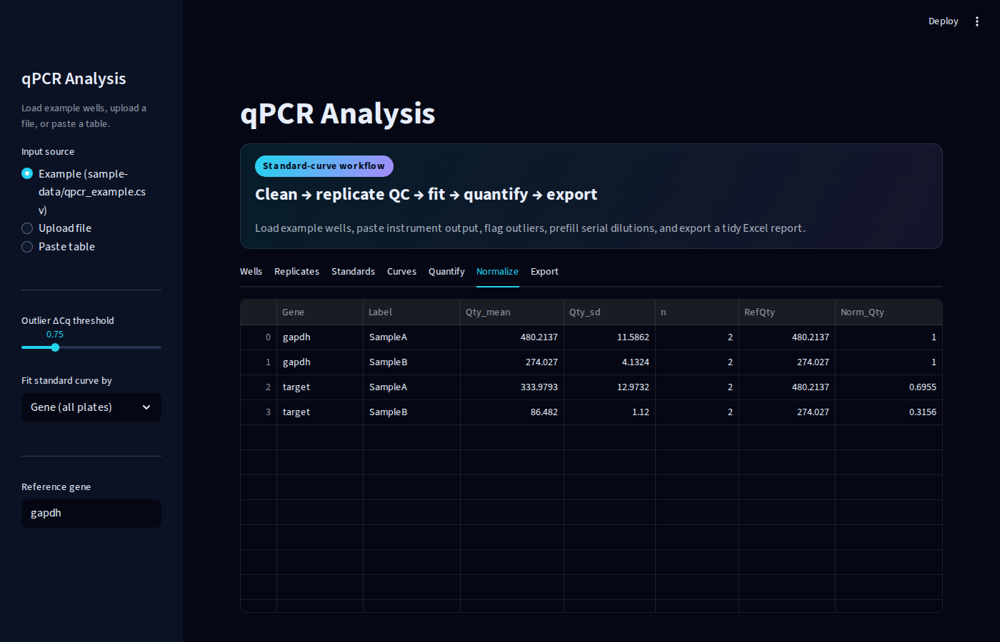
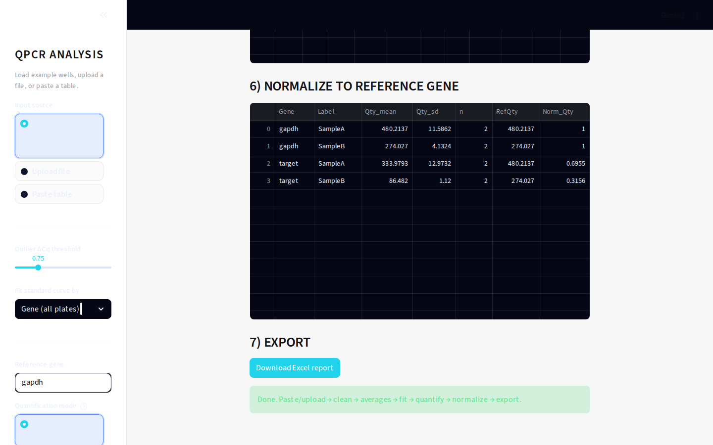

# qPCR Analysis App

Streamlit dashboard for quickly reviewing qPCR plates end-to-end – from pasted wells tables through replicate QC, standard curve fitting, absolute quantity estimation, ΔΔCt normalisation, and Excel export. The app is designed to work directly from the tables produced by most qPCR instruments, so you can validate a run without pre-processing in spreadsheets.

Status: this Streamlit app is the canonical version. A prior React/FastAPI experiment that lacked chart export has been removed to keep the repo lean.

## Highlights
- Paste CSV/TSV/Excel-style well tables or vendor exports; delimiter detection and case-insensitive column matching keep the input flexible.
- Automatically reshapes vendor-specific columns, derives replicate numbers, and flags negative or control wells.
- Per-gene tabs surface replicate statistics (mean Cq, SD, ΔCq), standard curve plots with slope/intercept/R²/efficiency, and concentration back-calculations.
- Calibrator-aware normalisation plus relative expression via 2^-ΔΔCt with selectable reference genes and calibrator pools.
- One-click Excel export (`qpcr_results.xlsx`) that bundles cleaned wells, replicate summaries, standard curve points & plots, quantities, and relative-expression tables.
- Includes `mock_wells.csv` so you can try the workflow without real instrument output.

## Screenshot

Example run using the bundled `mock_wells.csv` (loaded via the sidebar button) and default options:



Additional views from the full workflow:








## Quick Start
1. **Prerequisites:** Python 3.9+ and `pip`. Creating a virtual environment is recommended.
2. **Install dependencies**
   ```bash
   python3 -m venv .venv
   source .venv/bin/activate  # Windows: .venv\Scripts\activate
   pip install -r requirements.txt
   ```
3. **Run the dashboard**
   ```bash
   streamlit run app.py
   ```
4. Streamlit prints a local URL (typically http://localhost:8501). Open it in your browser.

## Using the Dashboard
1. **Step 0 – Paste wells:** Copy the table from your qPCR software and paste it into the sidebar text box. Required columns are `Gene`, `Label`, and `Cq`; optional metadata (Plate, Well, Type, Replicate, Concentration, Amp Status) is auto-detected. Or click **Load example wells (mock_wells.csv)** to fill in the bundled sample dataset instantly.
2. **Step 1 – Selection:** Toggle which genes to analyse, choose the reference gene, and select calibrator labels for ΔΔCt.
3. **Step 2 – Standard curve:** Standards with concentration data are fitted per gene; review slope/intercept/R²/efficiency and inspect the generated matplotlib plot.
4. **Step 3 – Quantities:** Sample Cq values are converted into absolute quantities using the fitted curve for each gene.
5. **Step 4 – Normalisation:** Quantities are normalised to the reference gene, exposing fold changes across samples.
6. **Step 5 – Relative expression:** 2^-ΔΔCt values are produced relative to the chosen calibrator pool, with warnings if prerequisites are missing.
7. **Step 6 – Missing standards:** Quickly spot genes lacking enough standard dilutions to produce a trustworthy curve.

Use the download button at the bottom of the page to collect all derived tables (plus rendered standard-curve plots) into a single Excel workbook for record keeping.

## Data format & quick AI helper
- Best-fit columns (CSV/TSV/Excel): `Plate, Well, Gene, Type, Label, Replicate, Cq`. Optional extras are ignored safely. See `sample-data/qpcr_example.csv`.
- To reshape quickly, use: [ChatGPT](https://chat.openai.com/), [Gemini](https://gemini.google.com/app), [Grok](https://grok.com/).
- Prompt: "Convert my table to CSV with headers: Plate, Well, Gene, Type, Label, Replicate, Cq. Keep my data, no invented rows, output UTF-8 CSV text only."
- Save as `qpcr_example.csv` (any name) and upload/paste. Visual helper: `screenshots/data-format-helper.svg`.

## Tips
- Paste data exactly as exported; the app trims whitespace, harmonises case, and interprets common "NA"/"Undetermined" tokens automatically.
- Keep at least two standard levels with known concentrations per gene to enable curve fitting.
- When experimenting, load `mock_wells.csv`, copy its contents, and paste them into Step 0 to see the full workflow.
- A small sample dataset is also in `sample-data/qpcr_example.csv` if you prefer to upload a file instead of pasting.

## How calculations are done
1) **Clean & outliers** – ΔCq per gene/label is median‐based; wells with ΔCq above the sidebar threshold are flagged. If a well is unchecked, its Cq becomes NaN.  
2) **Replicate collapse** – Wells sharing Plate/Well/Gene/Type/Label are averaged (mean Cq) before any downstream math. Extra columns keep the first value.  
3) **Standards** – For each gene (or Gene×Plate if selected):  
   - log10(conc) from the standards map vs mean Cq → linear fit (slope, intercept).  
   - R² and efficiency = (10^(−1/slope) − 1)·100.  
4) **Quantities (absolute)** – For each kept sample well:  
   - pred_log10Q = (Cq − intercept) / slope; Quantity = 10^pred_log10Q.  
5) **Normalisation to ref gene** – Per label, RefQty is the mean Quantity of the chosen ref gene; Norm_Qty = Quantity / RefQty.  
6) **Exports** – `PerWell_Normalized` carries one row per Plate/Well/Gene/Label with slope/intercept/pred_log10Q/Quantity/RefQty/Norm_Qty plus your metadata.  

### ΔΔCt option?
The app currently performs absolute quantification with ref-gene normalisation (step 5). A 2^-ΔΔCt readout is not yet exposed in the UI; we can add a toggle to pick a calibrator label and emit ΔΔCt/fold change if you want.

## Development Notes
- The Streamlit script lives in `app.py`; update it and re-run `streamlit run app.py` to see changes.
- Dependencies are listed in `requirements.txt`. Pin additional libraries there if you extend the workflow.
- No dedicated tests ship with the project yet; consider adding regression tests (e.g., with `pytest`) if you automate calculations outside the UI.
