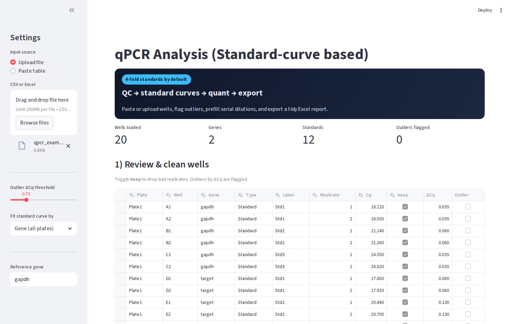
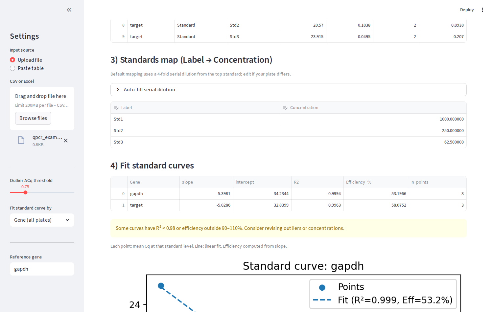

# qPCR Analysis (Streamlit)

Single-page Streamlit app for qPCR standard-curve analysis: clean wells, flag outliers, fit curves, quantify, normalize to a reference gene, and export results to Excel.

## Quick start

```bash
pip install -r requirements.txt
streamlit run app.py
```

The app prefills standards using a 4-fold serial dilution from the top concentration; tweak under “Auto-fill serial dilution” if your plate differs.

## Data input

- Upload CSV/TSV/Excel or paste a table. Required columns (case/spacing flexible): `Plate`, `Well`, `Gene`, `Type` (`Standard` or `Sample`), `Label`, `Replicate`, `Cq`.
- If `Cq` is missing, the app auto-picks the most numeric-looking column as `Cq`.
- Optional combined column like `SampleSexTreatmentAge` is split into `Sample/Label`, `Sex`, `Treatment`, `Age`.
- Extra columns are preserved in the data editor and Excel export.

## Features

- Outlier flagging by ΔCq with manual keep/drop toggles.
- Replicate stats by Gene/Type/Label.
- Standards mapping (Label → Concentration) with serial dilution autofill (default 4-fold).
- Standard-curve fitting (slope/intercept/R²/efficiency) with per-curve scatter + fit plots rendered inline.
- Quantification and normalization to a reference gene.
- Excel export with cleaned wells, replicate stats, standards map, curve points/fits, per-well quant, and per-sample normalized data.

## Notes

- The modern FastAPI/React scaffold has been removed; this project now runs solely as a Streamlit app (`app.py`).
-,Sample data lives in `sample-data/qpcr_example.csv` if you want a quick smoke test (paste/upload).***

## Screenshots

- Overview / cleaning:



- Standards and curve fit:


